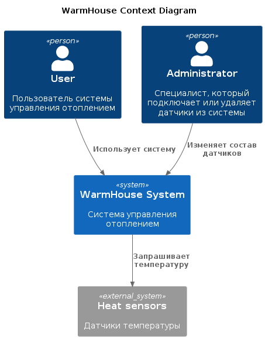
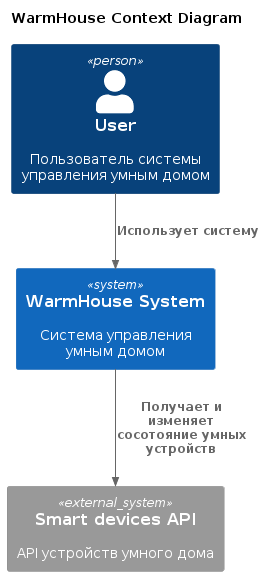
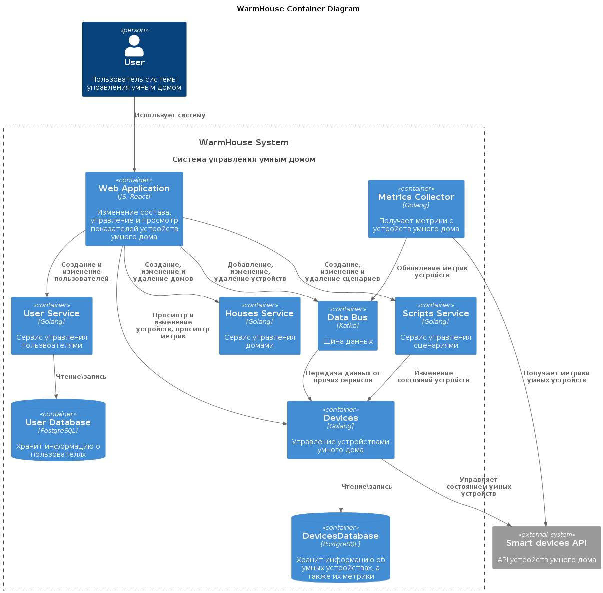
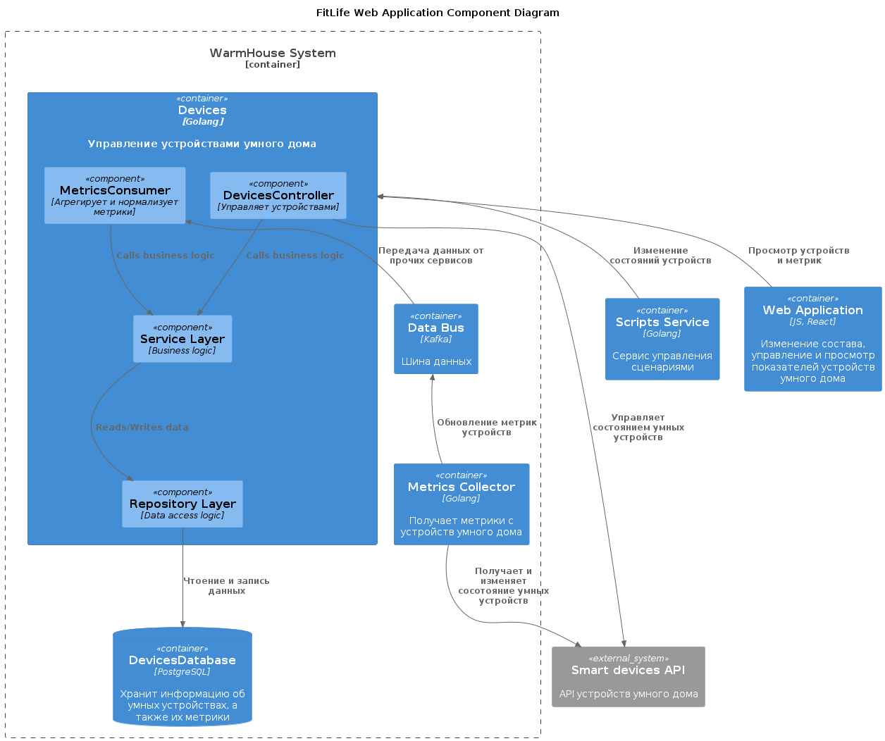
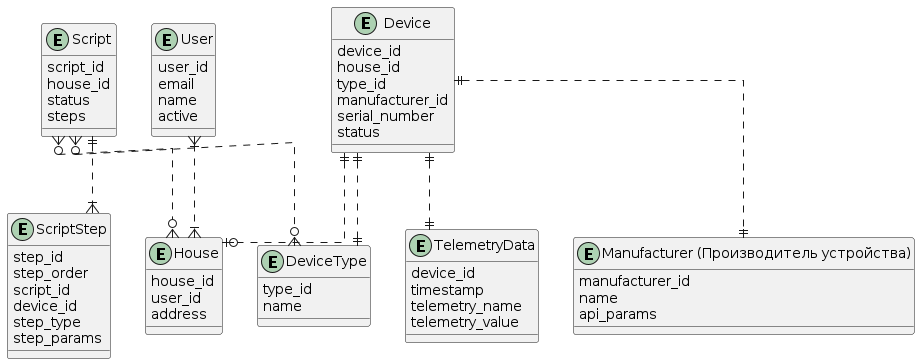

Это шаблон для решения **первой части** проектной работы. Структура этого файла повторяет структуру заданий. Заполняйте его по мере работы над решением.

# Задание 1. Анализ и планирование

Чтобы составить документ с описанием текущей архитектуры приложения, можно часть информации взять из описания компании условия задания. Это нормально.

### 1. Описание функциональности монолитного приложения (ASIS)

**Управление отоплением:**

- Пользователи могут удалённо включать/выключать отопление в своих домах.
- Система поддерживает удалённое включение/выключение отопление в домах

**Мониторинг температуры:**

- Пользователи могут просматривать текущую температуру в своих домах через веб-интерфейс.
- Система поддерживает получение данных о температуре с датчиков, установленных в домах.

### 2. Анализ архитектуры монолитного приложения

Язык программирования: Java
База данных: PostgreSQL
Архитектура: Монолитная, все компоненты системы (обработка запросов, бизнес-логика, работа с данными) находятся в рамках одного приложения.
Взаимодействие: Синхронное, запросы обрабатываются последовательно.
Масштабируемость: Ограничена, так как монолит сложно масштабировать по частям.
Развёртывание: Требует остановки всего приложения.

### 3. Определение доменов и границы контекстов

- Управление устройствами: Подключение, удаление устройств, изменении их состояния
- Мониторинг устройств и их показателей - сбор и просмотр телеметрии 
- Сценарии автоматизации - добавление, изменение и удаление автоматических сценариев работы устройств
- Управление домами - Управление кофигурацией домов пользователей

### **4. Проблемы монолитного решения**

- Деплой требует остановку всего приложения
- Сбои в одном модуле вызовут сбои всего приложения. 
Например, если множество пользователей пойдут проверять данные с датчиков, то добавление новых датчиков может оказаться невозможным.
- Проблема не монолита, а текущей архитектуры: для подключения к системе нового клиента, требуется выезд специалиста компании.

Пока что решение не вызывает проблем и нет данных, доказывающих, что проблемы возникнут. Также выглядит так, будто приложение можно доработать под растущие требования стейкхолдеров.
Однако можно декомпозировать приложение не на микросервисы, а просто на сервисы, чтобы избежать вышеобозначенных проблем и сэкономить бюджет при расширении бизнеса.
Сэкономленные ресурсы предлагается потратить на обучение разработчиков. В частности, новые микросервисы предлагается писать на golang, т.к. для его работы требуется существенно меньше ресурсов, он быстрый и многопоточный.
Фронтендеров предлагается обучить использованию React.
Если ресурсов на обучение не будет, то можно оставить текущий стек.
Для мобильного приложения ресурсов нет - нужно либо расширить штат, либо оставить только веб-версию.

Информации о том, где работают менеджеры по продажам и как осуществляются оплаты в исходном приложении нет. Будем считать, что есть некая CRM и/или некая 1С, в которой работают менеджеры по продажам и пренебрежем её расширением..

### 5. Визуализация контекста системы — диаграмма С4

# Задание 2. Проектирование микросервисной архитектуры (TOBE)

**Диаграмма контекста (Context)**

**Диаграмма контейнеров (Containers)**

**Диаграмма компонентов (Components)**

**Диаграмма кода (Code)**

На данный момент диаграмма кода не имеет смысла. Её стоит добавить непосредственно при разработке.

# Задание 3. Разработка ER-диаграммы

